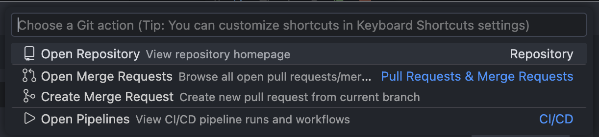
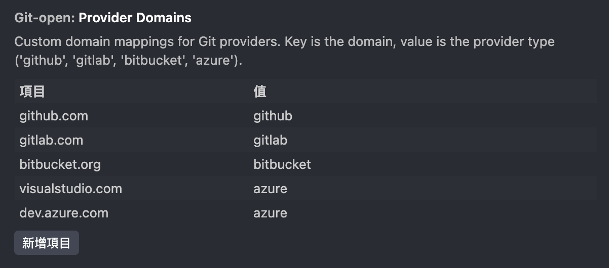

# Git Open - VS Code Extension

Quickly open Git repository pages in your browser. Support for GitHub, GitLab, Bitbucket, and Azure DevOps.

## Features

- **Open Repository**: Quickly open the current Git repository in your browser
- **Merge Requests/Pull Requests**: View and create merge requests or pull requests
- **CI/CD**: Access your pipelines and actions directly
- **Multiple Git Providers**: Support for GitHub, GitLab, Bitbucket, and Azure DevOps
- **Keyboard Shortcuts**: Quick access to all features

## Keyboard Shortcuts

| Command            | Shortcut         | Description                        |
|--------------------|-----------------|------------------------------------|
| Open Repository    | `Alt+G Alt+O`   | Open current repository in browser |
| Open Merge Requests| `Alt+G Alt+M`   | View merge requests or pull requests|
| Create Merge Request| `Alt+G Alt+R`  | Create a new merge request         |
| Open Pipelines     | `Alt+G Alt+P`   | View CI/CD pipelines               |
| Quick Access       | `Alt+G Alt+G`   | Show all Git Open commands         |



## Requirements

- Git Installed and Available in PATH
- Active Git Repository With Remote Configured

## Extension Settings

**Note for Private/Self-Hosted GitLab Domains**

If you are using a private or self-hosted GitLab instance (for example, `git.example.com`), the extension may not automatically recognize your domain as a GitLab server. In this case, you need to manually configure your domain as a GitLab instance in the extension settings to ensure full compatibility.

**How to Configure:**

1. Open VS Code Settings (`Ctrl+,` or `Cmd+,`).
2. Search for `git-open.providerDomains`.
3. Add a custom mapping for your domain.
   For example, to treat `git.example.com` as a GitLab instance, add:
   ```json
   {
     "git-open.providerDomains": {
       "git.example.com": "gitlab"
     }
   }
   ```
   You can do this via the settings UI (as an object) or directly in your `settings.json`.



This tells the extension to treat your specified domain as a GitLab server, enabling all GitLab-specific features.

### Commands Contributed

* `git-open.openRemoteRepo`: Open Remote Repository
* `git-open.openMergeRequests`: Open Merge Requests/Pull Requests
* `git-open.createMergeRequest`: Create Merge Request/Pull Request
* `git-open.openPipelines`: Open Pipelines/Actions

## Troubleshooting

### Extension not detecting Git repository

**Problem**: Commands don't work or show "Not a Git repository" error.

**Solution**:
- Ensure you have Git installed and available in your PATH
- Verify the folder is a Git repository by running `git status` in the terminal
- If not a Git repository, click the "Initialize Git" button in the error message or run `git init`

### Remote URL not found

**Problem**: Error message "No remote repository configured".

**Solution**:
- Check if your repository has a remote configured: `git remote -v`
- Add a remote if missing: `git remote add origin <your-repo-url>`
- Or click the "Add Remote" button in the error message

### Provider not recognized

**Problem**: Extension doesn't recognize your self-hosted Git provider (GitLab, GitHub Enterprise, etc.).

**Solution**: See [Extension Settings](#extension-settings) section below for how to configure custom provider domains.

### Commands not working in multi-repo workspace

**Problem**: Extension doesn't prompt for repository selection.

**Solution**:
- Ensure each workspace folder is a valid Git repository
- The extension will automatically detect and prompt you to choose when multiple Git repos are found
- Your selection is cached and prioritized for future use

## Known Issues

Please report issues on our [GitHub repository](https://github.com/iml885203/vscode-git-open/issues).

## Release Notes

See [CHANGELOG.md](CHANGELOG.md) for detailed release notes.

## License

This extension is licensed under the [MIT License](LICENSE).

**Enjoy!**
